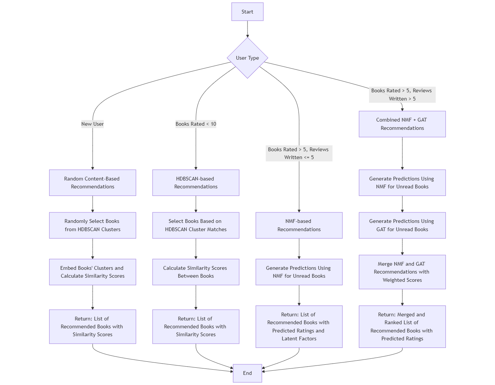

# 📚 Recommender-System-GoodReads  
**Undergraduate Thesis – University of York (2025)**  
**Dataset**: [Goodreads](https://mengtingwan.github.io/data/goodreads.html#datasets)

> [!CAUTION]
> Please read 'README' instructions in Data and Pickle Directories to download data files

---

## Project Overview  
Current recommendation methods often favour bestsellers and popular titles, leaving niche or lesser-known books overlooked. Goodreads, while widely used, fails to offer truly personalised and transparent suggestions due to its outdated design and popularity-based algorithms. This project addresses these limitations by building a hybrid recommendation system that combines collaborative filtering, content-based methods, and graph-based models to enhance:  
- **Accuracy**, even with sparse or cold-start data  
- **Novelty**, helping users discover overlooked books  
- **Explainability**, offering insights into why a book was recommended  
---
## Process Order
Order to run files in to duplicate whole project and results  
> [!CAUTION]
> None of the following needs to be rerun for the Hybrid Pipeline to work if all the data from [Google Drive](https://drive.google.com/drive/folders/1IME8HPKDIt1SNNqZM4rrcO8ERoihCjAC?usp=drive_link) is downloaded into the Pickle Directory

- **Process/LoadData**: Sample and merge datasets in 'Data' to align IDs, expand shelves, add genres, and save processed data into 'Pickle'.  
- **Process/EDA**: Exploratory plots and dataset statistics.
- **Embeddings/BookEmbeddings**: Uses `SentenceTransformer('all-MiniLM-L6-v2')` on combined book metadata (title, description, authors, genres, shelves).  
- **Embeddings/ReviewEmbeddings**: Same model, applied to review text. Saved to `Pickle/review_embeddings.pkl`.  
- **Embeddings/ReviewSentiment**: Uses `distilbert-base-uncased-finetuned-sst-2-english` via HuggingFace pipeline to assign sentiment scores and confidence. Saved to `Pickle/review_score.pkl`.  
- **Embeddings/UserGenres**: Extracts top 4 genres read by each user. Saved to `Pickle/user_most_common_genres.pkl`.  
- **RecSysJupyter/Gatv2Conv**: GATv2Conv Model trained and saved as `Pickle/gat_model.pth` and its dependencies to be loaded.
- **RecSysJupyter/HDBSCAN**: HDBSCAN Model built and clusers saved as `Pickle/clustered_books.pth` and its dependencies to be loaded.
- **RecSysJupyter/SVD**: SVD Model trained and imputed ratings saved as `Pickle/imputed_ratings.pkl` and its dependencies to be loaded.
- **RecSysJupyter/NMFratings**: NMF Model trained and saved as `Pickle/best_nmf.pkl` and its dependencies to be loaded.
- **Hybrid/Gatv2Conv.py**: GAT model to cload trained model for inference
- **Hybrid/Hybrid**: Hybrid pipeline, loads individual models

##  Hybrid System  

Main hybrid pipeline in 'Hybrid/Hybrid.ipynb' with gat .py file to load model.

## References
Mengting Wan, Julian McAuley, "Item Recommendation on Monotonic Behavior Chains", in RecSys'18.
Mengting Wan, Rishabh Misra, Ndapa Nakashole, Julian McAuley, "Fine-Grained Spoiler Detection from Large-Scale Review Corpora", in ACL'19.
